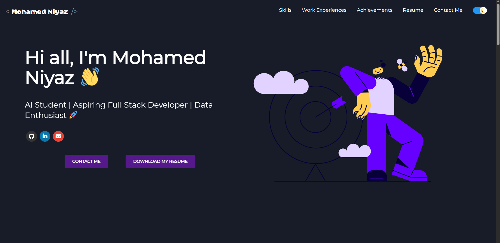
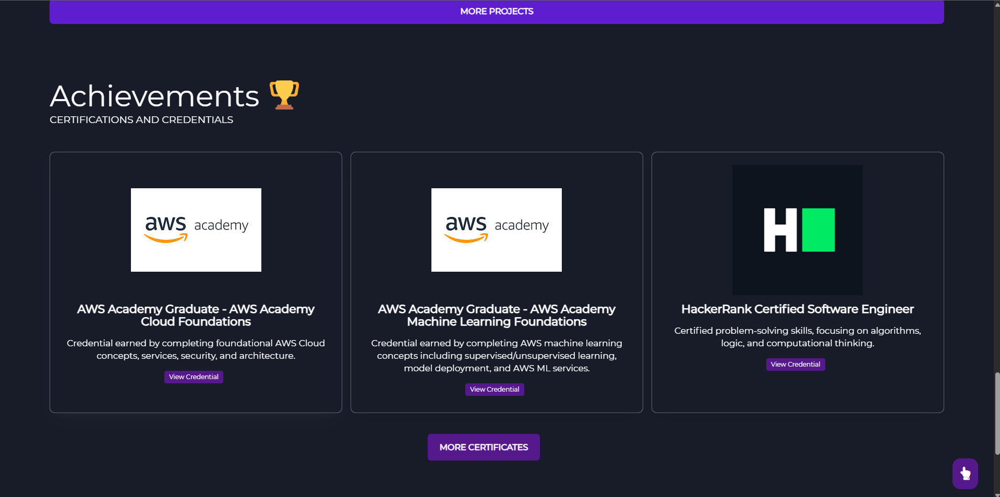

# 🌐 My Developer Portfolio

A modern, responsive developer portfolio to showcase projects, experience, and certifications. Built with a clean component structure and fast, SEO-friendly markup.

---

## 🚀 Live Demo
**URL:** [My Portfolio](https:/n1yxz.github.io)

---

## ✨ Features
- Responsive layout (mobile → desktop)
- Fast loads (optimized assets & code-splitting)
- SEO-ready (meta tags, social preview)
- Dark mode (toggleable, persists)
- Accessible (semantic HTML, keyboard nav)
- Project cards with filters & external links
- Contact section (email + socials)

---

## 🧰 Tech Stack
- **Frontend:** React, Vite (or CRA), HTML5, CSS3 / Tailwind CSS (optional)
- **UI:** (Optional) shadcn/ui, Framer Motion
- **Tooling:** NPM, ESLint, Prettier
- **Deploy:** Vercel / Netlify / GitHub Pages

> ⚠️ If your stack differs, edit this section.

---

## 🗂 Project Structure
project-root/
│
├─ public/ # Static files (favicon, og-image, robots.txt)
├─ src/
│ ├─ assets/ # Images, icons
│ ├─ components/ # Reusable UI components
│ ├─ pages/ # Page-level components (Home, Projects, Contact)
│ ├─ data/ # JSON/TS data for projects/skills
│ ├─ styles/ # Global styles / Tailwind config
│ └─ main.[tsx|jsx] # App entry
│
├─ .eslintrc.cjs
├─ .prettierrc
├─ package.json
└─ README.md

---

## ⚙️ Installation & Setup

1. **Clone the repository**
```bash
git clone https://github.com/n1yxz/n1yxz.github.io.git
cd [your-repo-name] 
``` 
2. Install dependencies
```bash
npm install
# or
yarn build
```
3. Run development server
```bash
npm run dev
# or
yarn dev
The site will be available at http://localhost:5173 (Vite) or http://localhost:3000 (CRA), unless you’ve configured another port.
```
4. Build for production
```bash
npm run build
# or
yarn build
```
5.Preview production build (optional)
```bash
npm run preview
```
🔧 Environment (optional)
Create a .env file in the project root if you use any keys (e.g., analytics, email API):

```ini
VITE_SITE_NAME="My Portfolio"
VITE_GA_ID="G-XXXXXXXXXX"
```
Rename keys if you’re not using Vite.


🧪 Scripts
```json
Copy
{
  "scripts": {
    "dev": "vite",
    "build": "vite build",
    "preview": "vite preview",
    "lint": "eslint .",
    "format": "prettier --write ."
  }
}
```
Adjust if you’re using CRA/Next.js/etc.


🔍 SEO & Meta
Add these to index.html (or your head component):

```html
Copy
<meta name="title" content="Mohamed Niyaz — Developer Portfolio" />
<meta name="description" content="AI & Software Developer portfolio: projects, skills, and certifications." />
<meta property="og:type" content="website" />
<meta property="og:title" content="Mohamed Niyaz — Developer Portfolio" />
<meta property="og:description" content="AI & Software Developer portfolio." />
<meta property="og:image" content="/og-image.png" />
<meta name="twitter:card" content="summary_large_image" />
```


🖼 Screenshots






📦 Deploy
Vercel
- Import repo in Vercel

- Framework preset: Vite (or your stack)

- Build command: npm run build

- Output directory: dist

Netlify
- Build command: npm run build

- Publish directory: dist
  
- Push to GitHub

GitHub Pages (for Vite)
```bash
npm i -D gh-pages
```
Add to package.json:

```json
{
  "homepage": "https://[your-username].github.io/[your-repo-name]",
  "scripts": {
    "predeploy": "npm run build",
    "deploy": "gh-pages -d dist"
  }
}
```
Then:

```bash
npm run deploy
```
🧑‍💻 Author
Name: Mohamed Niyaz

Portfolio: [https://n1yxz.github.io](https://n1yxz.github.io)

Email: [niyazmohamed14@email.com](niyazmohamed14@gmail.com)

LinkedIn: [https://www.linkedin.com/in/mohamed-niyazii/](https://www.linkedin.com/in/mohamed-niyazii/)

GitHub: [https://github.com/n1yxz](https://github.com/n1yxz)

🤝 Contributing
Contributions are welcome!

- Fork the repo

- Create a feature branch: git checkout -b feat/awesome-thing

- Commit: git commit -m "feat: add awesome thing"

- Push: git push origin feat/awesome-thing

- Open a Pull Request

📝 License (MIT)
Copyright (c) 2025 Mohamed Niyaz

Permission is hereby granted, free of charge, to any person obtaining a copy
of this software and associated documentation files (the “Software”), to deal
in the Software without restriction, including without limitation the rights
to use, copy, modify, merge, publish, distribute, sublicense, and/or sell
copies of the Software, and to permit persons to whom the Software is
furnished to do so, subject to the following conditions:

The above copyright notice and this permission notice shall be included in
all copies or substantial portions of the Software.

THE SOFTWARE IS PROVIDED “AS IS”, WITHOUT WARRANTY OF ANY KIND, EXPRESS OR
IMPLIED, INCLUDING BUT NOT LIMITED TO THE WARRANTIES OF MERCHANTABILITY,
FITNESS FOR A PARTICULAR PURPOSE AND NONINFRINGEMENT. IN NO EVENT SHALL THE
AUTHORS OR COPYRIGHT HOLDERS BE LIABLE FOR ANY CLAIM, DAMAGES OR OTHER
LIABILITY, WHETHER IN AN ACTION OF CONTRACT, TORT OR OTHERWISE, ARISING FROM,
OUT OF OR IN CONNECTION WITH THE SOFTWARE OR THE USE OR OTHER DEALINGS IN
THE SOFTWARE.
